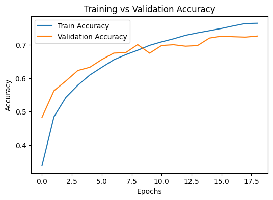
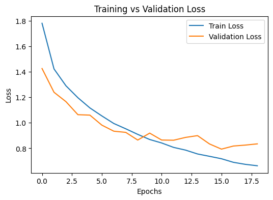
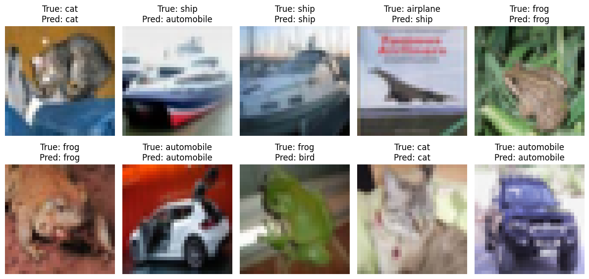
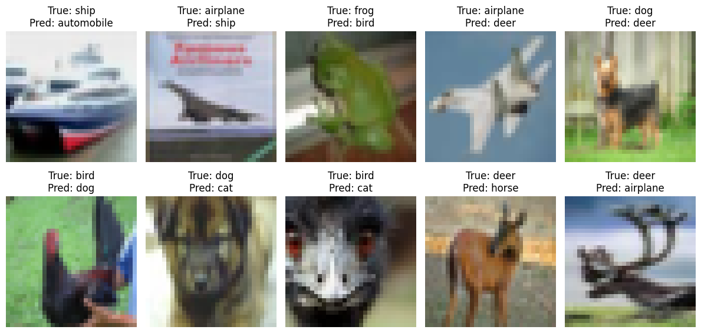

# Image Classification using CNN

## Overview
This project implements a Convolutional Neural Network (CNN) to classify images from the CIFAR-10 dataset.
The goal is to demonstrate end-to-end deep learning workflow including data preprocessing, model design,
training, evaluation, and result interpretation.

## Dataset
- CIFAR-10 (TensorFlow built-in dataset)
- 60,000 RGB images (32x32)
- 10 classes: airplane, automobile, bird, cat, deer, dog, frog, horse, ship, truck

## Tech Stack
- Python
- TensorFlow / Keras
- NumPy
- Matplotlib

## Project Workflow
1. Dataset loading and normalization
2. CNN architecture design (Conv → Pool → Dense)
3. Model compilation using Adam optimizer
4. Training with early stopping to prevent overfitting
5. Model evaluation on unseen test data
6. Visualization of predictions and misclassifications

## Model Architecture
- Three convolutional layers with ReLU activation
- Max pooling for spatial downsampling
- Dense layers with dropout for regularization
- Softmax output layer for multi-class classification

## Training Performance
- Early stopping applied based on validation loss
- Training and validation accuracy tracked across epochs

### Training Accuracy

### Training Loss

## Model Evaluation
- Evaluated on test dataset
- Visualized correct and incorrect predictions
- Identified challenges between visually similar classes

### Sample Predictions

### Misclassified Samples

## Conclusion
The CNN achieved reasonable accuracy on the CIFAR-10 dataset.
Misclassifications primarily occurred between visually similar classes, which is expected.
This project demonstrates practical deep learning skills including model optimization and evaluation.

## Future Improvements
- Data augmentation
- Deeper CNN architectures
- Hyperparameter tuning
- Transfer learning using pre-trained models
